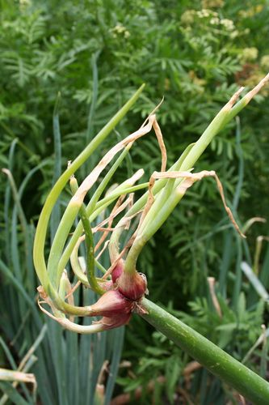
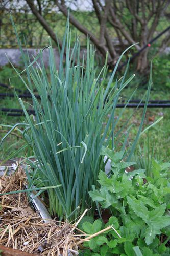
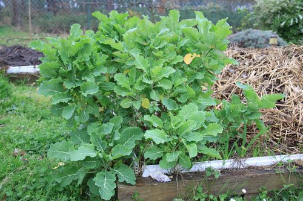
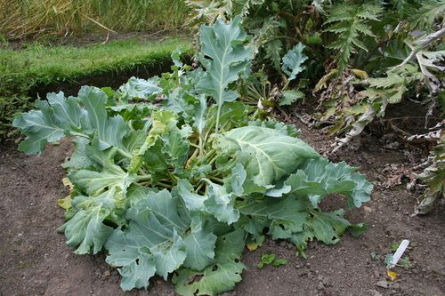
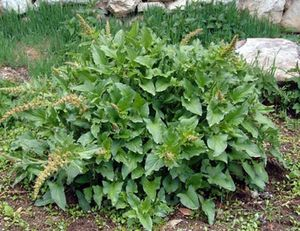
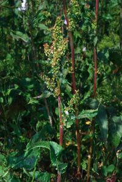
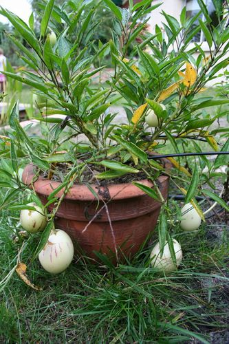

= Les plantes perpétuelles
Bernard Mayer
v1.0, 2020-11-24: First draft
//:source-highlighter: coderay
:source-highlighter: highlightjs
:sectnums:
:toc: preamble
:toclevels: 4
:toc-title: ToC
// Permet que la ToC soit numerotee
:numbered:
//:imagesdir: ./img
// :imagedir: ./MOS_Modelisation_UserCode-img

:ldquo: &laquo;&nbsp;
:rdquo: &nbsp;&raquo;

:keywords: Resilience Agro
:description: Je ne sait pas encore ce \
    que je vais écrire ici...
    
----
Préambule avant ToC
----

// ---------------------------------------------------

== Fournisseurs

=== Poireaux perpétuels
link:https://m.fermedesaintemarthe.com/A-12281-poireau-perpetuel-plant.aspx[]

== Infos

=== 13 aliments qui repoussent dans l’eau pour réaliser des économies
link:https://www.diy.fr/idee/13-aliments-repoussent-dans-l-eau-pour-realiser-des-economies/[]

=== Les légumes perpétuels par Vavou
link:http://conseiljardin.over-blog.com/article-les-legumes-perpetuels-70897205.html[]

Voici une curieuse façon de cultiver un potager mais que les futés du jardinage adopteront volontiers. 
Parmi les légumes, un certain nombre peuvent survivre plusieurs années et continuer à produire pendant de longs mois. 
Plus besoin de labourer, semer et conserver la récolte ! 
Rustiques, ils peuvent pousser partout en France, parmi les fleurs ou le potager pourvu que l’endroit soit ensoleillé. 
Les légumes perpétuels sont souvent proches des espèces sauvages aussi leur saveur souvent typée fait le bonheur des gourmets.

==== L’oignon rocambole (Allium cepa var proliferum)
 

On le dit perpétuel car vous n’avez pas besoin d’arracher la plante pour consommer les bulbes et il reste en place de nombreuses années. 
Il suffit de récolter les bulbilles qui se forment en haut des tiges après la floraison. 
On l’appelle aussi oignon grelot ou oignon d’Egypte du fait de son origine ou bien encore, échalote d’Espagne en référence à ses qualités gustatives. 
Sa silhouette hirsute, son feuillage bleuté persistant et sa floraison en boules roses en été en font une plante amusante à mettre au jardin.
Les tiges vertes de 50 cm à 1 m de haut, remplacent agréablement le poireau ou la ciboule. 
Elles peuvent être prélevées tout l’hiver. 
Les petits oignons, arrivés à maturité, sont délicieux confits au vinaigre pour aromatiser les cornichons mais on peut les manger crus ou cuits, en fricassées comme les autres oignons.
 
Au printemps ou à l’automne, plantez ses bulbilles ou semez les graines, dans une terre plutôt sableuse et humide, à exposition ensoleillée, ou bien en pot pour orner terrasses et balcons. 
Evitez les fumures organiques qui font pourrir le bulbe. Espacez les pieds de 30 cm.
L’oignon catawisa est un proche parent au goût un peu moins fin mais il est plus rustique.

==== Poireau perpétuel à gousses (Allium porum)

Très intéressant, ce poireau vivace produit une touffe de tiges de la grosseur d’un doigt que l’on récolte au fur et à mesure des besoins. 
La touffe continue à grossir d’années en années. 
Elle fleurit tardivement et surtout résiste au ver du poireau et aux froids vigoureux.
C’est un poireau aromatique au goût légèrement sucré qu convient aux soupes, omelettes et quiches. 
Il assaisonne les salades, se mange en vinaigrette ou en gratin.

Plantez les bulbilles au soleil, entre septembre et mars, distantes de 20 cm (40 cm entre les rangs),  semez en mars en pépinière pour repiquer en mai-juin ou, divisez la touffe. 
Le poireau aime les terres meubles, bien fumées et des arrosages fréquents. 
La récolte peut débuter dès fin août et se prolonger tout l’hiver. 

==== Le chou perpétuel {ldquo}Daubenton{rdquo} (Brassicae oleracea convar. acephala)

Il forme un arbuste ramifié de 80 cm à 1,20 m. 
Chaque pousse forme un petit chou tendre aux saveurs mêlées de chou brocoli et de chou blanc. 
La récolte se réalise au fur et à mesure des besoins, ce qui provoque l’apparition de nouveaux jets.
Ces jeunes pousses peuvent se consommer râpées en salade ou bien comme les autres choux, en fricassées ou potées.

Plantez-les au soleil, dans un sol bien drainé. 
Apportez du compost ou du fumier bien décomposé à la plantation, puis en surface, durant les années qui suivent afin de maintenir son niveau de production. 
La multiplication se fait très facilement par bouture de jets. 
Il fleurit rarement.

==== Le chou marin : tendre comme des asperges (Crambe maritima)

Le chou marin probablement l’ancêtre des choux cultivés est également vivace. 
Il pousse dans les galets et les sables grossiers sur le littoral de la Manche et de l’Atlantique. 
Son feuillage découpé et sa floraison blanche en mai sont très décoratifs dans un massif de fleurs. 
En Angleterre, ses jeunes pousses à peine étuvées, sont très appréciées pour leur goût de noisette.
Afin d’ôter l’amertume, recouvrez la plante en février-mars d’un pot retourné ou de paille pour faire blanchir les pétioles (ou côtes), tendres comme des asperges. 
Ses fleurs parfumées ajoutent aussi une saveur subtile aux salades.

Plantez le crambe, au soleil de préférence, en sol profond, sec et pas trop acide. 
Il s’accommode parfaitement d’un sol pauvre. 
La plante mesurant jusqu’à 60 cm de haut est à protéger des vents violents. 
Semez sous châssis froid, en mars ou en octobre ou faites des boutures de racines en janvier. 
La plante sauvage est protégée. 

==== Un épinard à portée de main : le chénopode Bon Henri (Chenopodium bonus-henricus)

Ce prénom singulier était donné autrefois aux plantes qui poussent préférentiellement au voisinage de l’homme. 
Il est donc fréquent de rencontrer ce chénopode près des habitations, des murs, des décharges... 
Le Bon Henri pousse plutôt en altitude près des chalets d’alpages. 
En plaine, le chénopode blanc (ou ansérine), annuel est plus fréquent et s’utilise de façon similaire. 
Le premier est une vivace qui forme des touffes de 20 à 60 cm, aux feuilles triangulaires épaisses, vert foncé, à la base en fer de lance.
 
Dès le mois d’avril, les feuilles sont consommées comme des épinards, en soupe mêlées à d’autres légumes, ou pour rehausser le goût des salades. 
Les extrémités de pousses sont cuites et servies comme des asperges.

Il pousse en plein soleil dans un sol bien drainé et se propage par semis. 

==== L’oseille épinard (Rumex patienta)

Cette oseille perpétuelle est un légume de saveur beaucoup moins acide que les autres oseilles. 
Son goût s’apparente à celui des épinards mais sa culture est bien moins exigeante. 
Très productive, la récolte des feuilles stimule l’apparition de nouveaux feuillages. 
Ceux-ci disparaissent toutefois en hiver pour renaître dès le début du mois de mars.

Semez l’oseille épinard, au printemps, en ligne, avant d’éclaircir et repiquez les plants en surnombre. 
Choisissez une exposition ensoleillée pour installer les plants qui ne dépasseront pas 15 cm de haut.

==== Melon-poire ou pepino (Solanum muricatum)

Fini les corvées de plantation, de taille et tuteurage, le pépino est une plante des régions chaudes qui pousse très bien dans un pot que vous rentrerez l’hiver. 
Les fruits en forme d’œuf sont de taille variable selon les variétés, leur poids peut atteindre 1 kg. 
Leur goût rappelant à la fois la poire et le melon lui ont valu ses surnoms de poire-melon ou melon-poire.
Vous pouvez la conduire comme un pied de tomate en supprimant les ramifications quand elles apparaissent. 
Elle est aussi productive si vous la laissez buissonner naturellement. 
Elle atteint alors 50 cm de haut.

La plante nécessite du soleil afin que les fruits mûrissent avant les premières gelées. 
Pour conserver la plante pendant l’hiver, plantez le pépino dans un pot assez large et rabattez–le à 10 cm du sol quand il a fini de produire, à l’automne. 
Placez le pot dans une pièce hors-gel puis, opérez un rempotage au printemps. La culture en pleine terre dans une serre est possible. 
Il suffit de protéger le pied rabattu par un paillage généreux de la souche.
Vous pouvez aussi conserver les plants en effectuant des boutures de 10 cm de long en fin d’été (99% de réussite). 
Conservez les jeunes plants à l’intérieur en attendant de pouvoir les sortir en mai. 
Le fruit produit peu de pépins, c’est pourquoi le bouturage est conseillé. 

