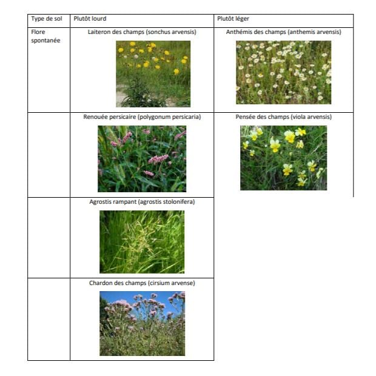

= Notes à propos de l'agro: Et son sous-titre
Bernard Mayer
v1.0, 2020-08-31: First draft
:source-highlighter: coderay
:sectnums:
:toc: preamble
:toclevels: 4
:toc-title: ToC
// Permet que la ToC soit numerotee
:numbered:
//:imagesdir: ./img
// :imagedir: ./MOS_Modelisation_UserCode-img

:ldquo: &laquo;&nbsp;
:rdquo: &nbsp;&raquo;

:keywords: Resilience Agro (sol)
:description: Je ne sait pas encore ce \
    que je vais écrire ici...
    
----
Préambule avant ToC
----

// ---------------------------------------------------

== Analyse par dilution ?
Photo d'un dépot argile / limon / sable
https://www.facebook.com/groups/MaraichageSolVivant/?post_id=2944487588990488 

== Bonne synthèse groupe FB Maraichage Sol Vivant"
link:https://www.facebook.com/permalink.php?story_fbid=983319518802832&id=100013743780137[] + 
// https://www.facebook.com/permalink.php?story_fbid=983319518802832&id=100013743780137&__cft__[0]=AZWn-A9bmxP9byKMcu17XTklJp8ObmVLczVD_wiKJvTQjqt5bF0c8DjSocvOQkybsUWkmyU2t1H9wut8-FbVlcdJ1Tx86bzL7tI709fz8nw8jIgaEgR4YfGVY5zJHURgbcM&__tn__=%2CO%2CP-R
TUTO : ANALYSE DE LA TERRE A MOINDRE COUT POUR UN 1ER JARDIN. + 
réalisé par link:https://www.facebook.com/profile.php?id=100013743780137[Perceval Le Paysan Gaulois]

Pour commencer, il nous faut connaitre la nature de notre sol, afin de pouvoir ensuite lui apporter ce qui lui manque.
Pour ce faire, on peut déjà observer...Regardez ce qui pousse naturellement sur celui ci vous donnera les premières indications...et ensuite, avec quelques tests simples on va pouvoir connaitre un peu mieux notre terre de départ...

Pour commencer il faut donc observer...On sait que dans les sols lourds, argileux, on trouvera fréquemment, des renouées persicaire, des chardons, du laiteron, ou encore de l’agrostis rampant
Dans les sols légers, donc plus sableux, les pensées des champs ou l’anthémis des champs forment naturellement des colonies importantes.
Ces plantes ne sont significatives que lorsqu’elles sont dominantes.

Ensuite vous devez savoir que vous pourrez avoir 3 types principales de textures de sols : 

**Argileux :** ce sont les particules les plus fines. Un sol majoritairement argileux est lourd, se réchauffe lentement et se fendille en cas de sécheresse.
Il retient efficacement l’eau et les engrais.
Les apports de matières organiques doivent être espacés dans le temps mais copieux.

**Limoneux :** Les limons constituent le stade intermédiaire entre argiles et sables. Les terres limoneuses sont en général battantes et se tassent facilement. Des engrais verts et une couverture du sol sont bénéfiques et parfaitement adaptés à ce type de sol. Ce sont des terres souvent idéales pour les cultures légumières et les arbres fruitiers.

**Sableux :** le sable est l’élément le plus grossier. Ce sont les sols légers. Les terres sableuses se réchauffent facilement et permettent ainsi des cultures précoces. Pauvres en matières organiques (car les retenant très difficilement), les apports de matières organiques (fumiers, composts, feuilles, pailles, foins, coupes d’herbes, résidus de récolte, brf…) doivent y être fréquents et modérés. Les sols sableux sèchent également facilement. Souvent acides, il peut alors être utile d’y apporter également des amendements calcaires (type lithothamne). 
Les engrais verts y sont en général déconseillés, car puisant dans les faibles réserves.

Bien entendu, les sols ne sont jamais totalement sableux, limoneux ou argileux mais contiennent des proportions variables de ces éléments. Par exemple, un sol est dit sablo-limoneux s’il contient une majorité de sable puis ensuite une quantité notable de limons…

Nous passons aux tests : 

**Test de granulométrie simple :**
Celui-ci sert à confirmer votre analyse faite sur l’observation de la végétation spontanée.

Prenez une poignée de terre humide (ou mouillez-la au besoin) et étalez-la en la roulant avec une bouteille.

L’épaisseur de la pâte que vous parviendrez à obtenir, sans qu’elle se brise, vous indique la texture de votre sol :

* Sol argileux : moins de 3 mm d’épaisseur.
* Sol limoneux : de 3 à 5 mm d’épaisseur.
* Sol sableux : impossible d’étaler la pâte sans la briser.

Vous pouvez également, comme autre méthode ou pour confirmer, faire un 2eme test qui consiste à mettre dans une bouteille un bon quart de terre du futur jardin.

Pour ce faire, prélevez a plusieurs endroits du jardin un peu de terre à 10/15cm de profondeur, mélangez bien le tout, puis servez vous afin de mettre en bouteille.

Puis ajouter de l eau jusqu'au 3/4 de la bouteille.
Secouer énergiquement et laisser reposer jusqu' au lendemain, et là magie, les élément se sont séparés...
Vous trouverez au fond la matière la plus grossière ,le sable, puis une couche intermédiaire, le limon , puis la plus fine, l argile.
La couche la plus épaisse vous indiquera la composition dominante de votre terre.

Vous savez à présent quel est le type dominant de votre terre...
Quel que soit le type de sol, on ne le modifiera pas du jour au lendemain (à moins d’y renouveler totalement la terre)…toutefois, des apports réguliers de compost allégeront les sols lourds et donneront plus de corps aux sols légers.
Les sols légers nécessitent des apports fréquents mais modérés de compost alors que les sols lourds profitent au mieux d’apports espacés dans le temps mais copieux.

**deuxième test :** +
SOL ACIDE OU CALCAIRE ? + 
Il vous faut connaitre le ph de votre sol.
un sol est acide si son ph est inférieur à 7
il est neutre si son ph est égal à 7
il est alcalin (ou basique) si sont ph est supérieur à 7.
Certaines plantes supportent mal le calcaire, d’autres les sols acides (qui favorisent par exemple des maladies sur le chou)… Le jardin idéal a un ph proche de la neutralité car il pourra ainsi accueillir la plupart des cultures.
Avec des moyens très simple, on pourra déterminer la tendance de notre sol :

*Test du vinaigre :* +
Pour savoir si un sol est calcaire, versez un peu de vinaigre blanc dessus : +
Si une réaction effervescente se produit, le sol est calcaire +
Si la réaction est très faible, il est proche de la neutralité +
Si elle est nulle,  il est neutre ou acide… +
Le test du bicarbonate va nous permettre de préciser cela

*Test du bicarbonate :* +
Le test du bicarbonate vous indiquera si votre sol est acide : +
Mélangez un échantillon de terre avec un peu d’eau déminéralisée (au PH neutre) puis mélangez bien +
Versez du bicarbonate sur ce mélange + 
Si vous pouvez observer une réaction, votre terre est acide + 
En résumé : + 
Effervescence au test du vinaigre = sol calcaire (plus l’effervescence est importante, plus le sol est calcaire) + 
Effervescence au test du bicarbonate = sol acide (plus l’effervescence est importante, plus le sol est acide) + 
Aucune effervescence, ni avec le vinaigre, ni avec le bicarbonate = sol neutre (ou proche de la neutralité)

De même, la végétation de départ donne une indication très fiable de l’acidité d’un sol : + 
Dans les sols acides, on trouve fréquemment de la bruyère, des fougères, genêt à balais, de la petite oseille, de la digitale pourpre,  de l’ajonc, des châtaigniers… + 
Dans les sols calcaires, on trouvera notamment de la chicorée sauvage, de l’ellébore, de la moutarde des champs, du sainfoin, de la sauge des prés, du viorne, des cerisiers, des ormes, des sureaux… 

Vous connaissez maintenant le ph de votre sol.

Du coup, que faire?
Un sol trop acide peut être amélioré par des apports d’amendements calcaires ainsi que d’engrais organiques riches en calcium comme du lithothamne ou maërl, du sable calcaire, de la roche magnésienne et calcaire.

Un sol au contraire calcaire bénéficiera de cultures d’engrais verts comme la moutarde…Les amendement et engrais riches en calcium sont évidemment à proscrire. Mais pourquoi ne pas tester alors un BRF  constitué notamment de résineux, (ce qui est en général déconseillé) pour acidifier quelque peu un sol trop calcaire ?

Vous avez bien avancé, mais ce n'est pas tout ce qu'il faut savoir...

Il est très important également de connaitre la teneur en humus (matières organiques stables représentant environ 85 % des matières organiques totales du sol, le reste étant constitué de matières organiques en cours de décomposition) ?
En effet, un bon sol de jardin doit contenir au moins 5 % de matières organiques.

Encore une fois, il vous faut observer votre terre de départ  qui vous indiquera la richesse du sol: + 
Si vous avez des petites et grandes orties, chénopodes, amarantes, chiendent, arroches, lamiers blancs et lamiers pourpres, sureau noir, mouron blanc, mercuriale annuelle…sont des plantes indiquant un sol riche en humus. +
La présence de ces plantes, surtout si elle est particulièrement marquée, est un bon signe. Mais, n’oubliez pas que même si votre terre est riche, il convient néanmoins de la nourrir.

Par la suite, une fois le jardin lancé, l'observation de ce dernier vous donnera également des indications sur sa teneur en humus. + 
Dans un sol suffisamment riche en humus, on observera une croissance rapide des plantes cultivées et un feuillage bien développé.

Vous connaissez maintenant la richesse (humus) de votre sol.
cela dit il faut tout de même continuer à le nourrir  efficacement avec des matières organiques diverses : fumiers, compost, mulch (pailles, foin, herbes coupées, BRF…) afin de maintenir voire d'améliorer  la teneur en humus de la terre de votre jardin…qui vous le rendra en récoltes abondantes.

Voila les bases de départ d'un 1er jardin.

== Un autre exemple sur MSV
link:https://www.facebook.com/groups/MaraichageSolVivant/permalink/3136745506431361/[]

Ce terrain est complètement différent de celui que j'exploite en perma actuellement. J'ai l'habitude de l'argile et là on est sur un terrain très sableux limoneux.
J'ai fait quelques prélèvements pour tester le ph qui est de 6. Très peu de vie d'ailleurs puisque j'ai croisé 2 pauvres vers de terre en creusant à une dizaine d'emplacements différents. À croire qu'ils étaient soit téméraires, soit dépressifs...
Le terrain était en fermage avec un poney dessus. Puis l'année dernière le propriétaire a tenté les patates mais elles se sont retrouvées le cul dans la flotte en début de printemps avec toute l'eau qui est tombée, et la récolte s'est avérée très rachitique...logique.
J'ai pris quelques photos pour vous donner une idée du terrain, et de la terre. 
J'ai aussi repéré les plantes bio indicatrices mais je ne suis pas certain de mon diagnostic... Il y a pas mal de morelle noire, de lampourde épineuse, anserine noire. Aussi de l'herbe classique bien grasse. 
Alors, mon idée, passer le tracteur avec. La griffe, puis un coup de herse rotative. Faux semis très rapide car je suis à la bourre pour lancer mon engrais vert un mélange de( trèfle incarnat, vesce, fèves, moutarde, raifort, avoine, seigle, ferovole, lentille, lin, phacelie).
Les coucher 2 mois plus tard, puis soit bâcher pour 2 mois minimum, soit l'enfouir avec un coup de herse rotative ? Soit le laisser coucher au sol et planter directement dedans ?
Que puis faire aussi pour améliorer mon sol en complément des engrais verts ? Un apport de fumier composté ne serait pas de trop ? Si ?
J'ai fait un test aussi dans un bocal rempli de terre et d'eau pour voir la composition générale. Donc on va dire à peu près 45% de sable 45% de limon 8% d'argile, 2% de MO.

== Quelques documents construits en butinant le web...

link:aujardin.info_ReconnaitreEtAmeliorerSaTerre.docx[]

link:gerbeaud_MonSolEstIlArgileuxSableuxCalcaireAcide.docx[]

link:greenastic_ConnaitreSonSol.docx[]

link:jardinage.lemonde_DifferentsTypeDeSol.docx[]

link:jardiner-autrement_ConnaitreLaNatureDeSonSol.docx[]

link:lepotiblog_ConnaitreSonSol.docx[]

