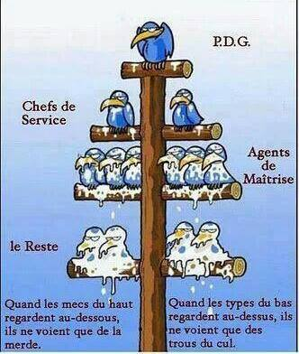
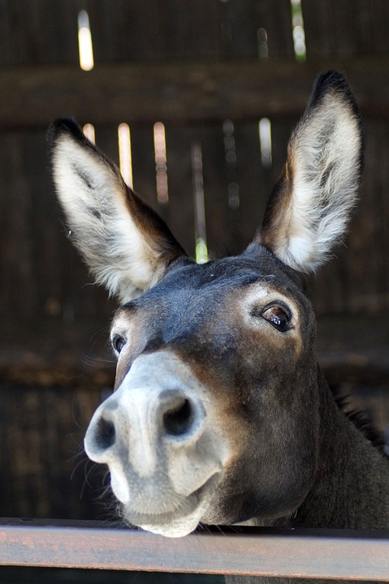

= Resilience
= Au sujet de la construction immobilière et autres sujets vaguement apparentés
Bernard Mayer
Bernard Mayer
v1.0, 2020-08-25
v0.1.0, 2022-03-15: First draft
:toc-title: ToC
:source-highlighter: coderay
:sectnums:
:toc: preamble
:toc: preamble
//:imagesdir: ../img
:toclevels: 4
:toc-title: Table des matières
:numbered:
//:imagesdir: ./img
// :imagedir: ./MOS_Modelisation_UserCode-img

:ldquo: &laquo;
:ldquo: &laquo;&nbsp;
:rdquo: &raquo;
:rdquo: &nbsp;&raquo;

:keywords: Resilience Abri
:description: Je ne sait pas encore ce \
:description: Je ne sait pas encore ce \
    que je vais écrire ici...
    que je vais écrire ici...

// ---------------------------------------------------
----
Ne dépendre de personne... +
Ni dieu ni maître ? Peut-être... Vous en pensez ce que vous voulez, vous êtes (peut-être) libre
----
----
Ce document se veut un guide vers les différentes parties du sujet. 
Au fur et à mesure de son alimentation, il faudra extraire des parties de ce document en documents annexes, liés à ce document :ldquo: parent :rdquo: par des liens.
== Quoi qu'il y a dedans ?
----

* link:./Abri[Abri]
* link:./Agro[Agro]
* link:./Eau[Eau]
* link:./Faire[Faire]
* link:./Lire[Lire]
* link:./Manger[Manger]

// 

|===

|Pourquoi ?|Qui suis-je ?

| Car je n'aime pas être parmi les oiseaux du perchoir du dessousfootnote:[Et pas non plus au dessus...]. + 
 
    | 

|===
// ---------------------------------------------------

link:https://www.sismique.fr/post/changement-climatique-on-refait-le-point[]

include::Abri.adoc[]
